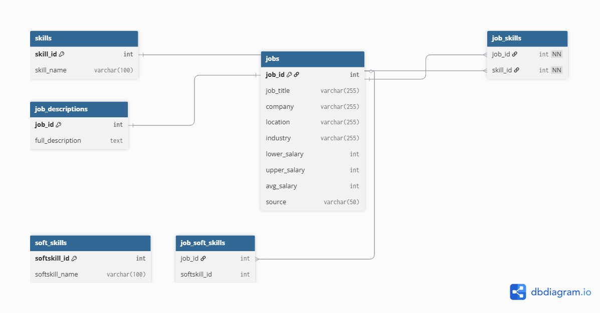

## Overview

We will communicate on slack and with occasional Teams meetings. Code will be shared on Github and uploaded using Git. We will each have our own branch of code to update before updating to main.

Data sources: a [Kaggle data scientist salary data set](https://www.kaggle.com/datasets/nikhilbhathi/data-scientist-salary-us-glassdoor) cross-referenced with [articles](https://online.nyit.edu/blog/data-science-skills) [detailing](https://www.pragmaticinstitute.com/resources/articles/data/must-have-data-science-skills-for-2023/) in-demand skills for data scientists and recent job postings from BuiltIn. We will load the data set as a .csv file onto GitHub and scrape relevant articles.

### Data Choice Explanation

We’ve chosen a large-scale job posting dataset that includes job titles, salaries, skill flags (like Python, SQL, AWS, and Tableau) because it’s structured, semi-cleaned and ready to be analyzed.  We will also use recent BuiltIn job postings (supplemental data) to assess up-to-date skill requirements reflecting the 2026 job market. These postings include qualitative details (e.g., soft skills, modern tools like LLM knowledge). This will help us benchmark the Kaggle dataset with present-day job demands.

### **Unstructured Data Extraction**

-   We’ll scrape html data, including:

-   Tools (PowerBI, Tableu etc)

-   Required Programming Skills (R, Python, SQL, Scala, etc.)

-   Soft skills (Presentation, communication, collaboration et)

-   Salary

-   Job description text

-   Industry domain

-   Job seniority

### **Analysis**

To answer the question, “Which data science skills are most valued?” we’ll explore questions like:

-   What are the most common required skills?

-   Which skills are correlated with a higher salary?

-   Can we quantify a skill’s value (e.g. a job that requires python, pays, on average, x amount more than a job that does not)?

-   What soft skills are frequently required?

-   How are soft skills (presenting, communication) valued vs. hard skills?

-   What (if anything) does title mean? Are certain skills associated with a data scientist/analyst/engineer? On average, what is the pay differential between these titles?

-   What fields (e.g., finance, education) are the most lucrative? Do these require a particular skill?

-   What is the average/median years of experience requirement? Do certain fields tend to require more years of experience? How much is each YOE worth? Is it linear?

### **Roles**

-   Mei - data acquisition

-   Ramde - data preparation

-   Sam - exploratory analysis

-   Robert - modeling

### Relational database

This is a normalized database model where each job posting is stored once, and skills are stored separately so they're not repeated. Technical skills and soft skills are linked to jobs through many‑to‑many tables.

